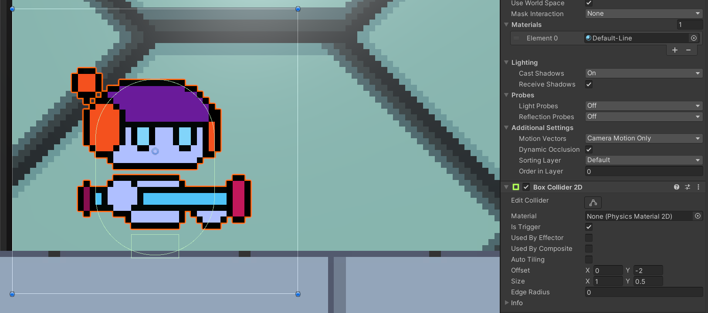
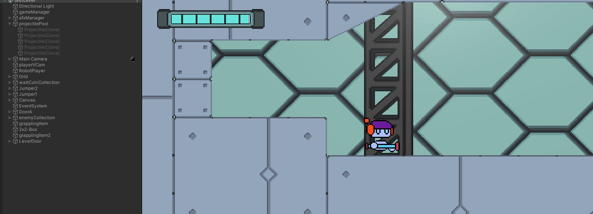
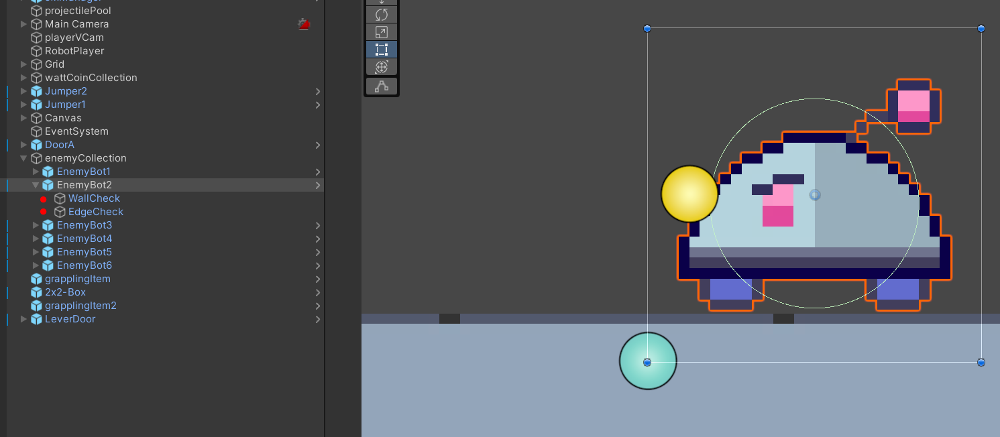
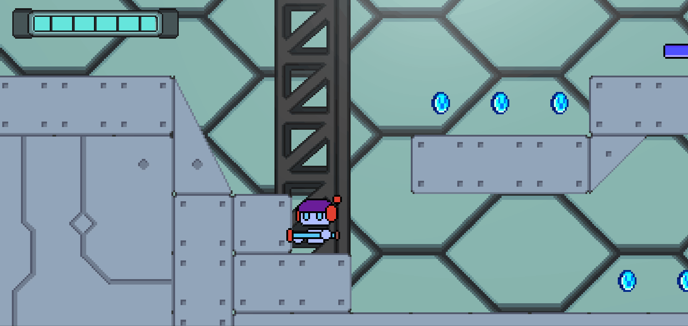
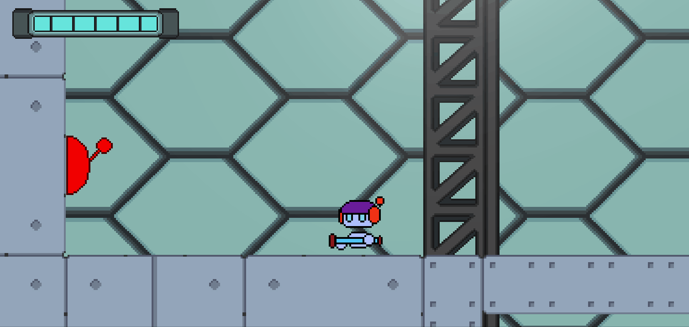
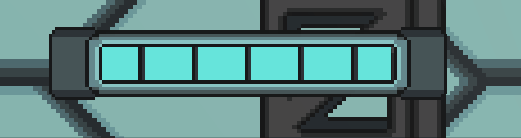

# 2D Platform Game Project

## About the Project

This is a prototype of a 2D platform and action videogame where we will control a robot in a stage surrounded by enemies and other elements to interact with.

## Character Control

We can use different controls with our character starting with the movement. 
To be able to control the movement more accurately rigidbody2D velocity has been used in all character movements:

```
  horizontalInput = Input.GetAxisRaw("Horizontal");
  float currentSpeed = horizontalInput * speed * Time.fixedDeltaTime;
  Vector2 velocity = new Vector2(currentSpeed, rb2D.velocity.y);
  rb2D.velocity = velocity;
```

For the jump, a 2D box collider with trigger activated has been added, so that it detects the ground and only lets the character jump when it is attached to it.



For the shots of the projectiles the pooling technique has been used. In the "objectPool.cs" script, a certain number of projectiles are instantiated at the start of the game and enabled or disabled as needed. In case that more projectiles than usual are needed, a new one is instantiated.



## Character Animations

The character features idle, walking, and jumping animations.
The first one occurs when we don't move, the second one when we move (the character does a flip to the sprite depending on whether he moves to the left or to the right). And finally, when we jump, there is an animation when the character moves up and another when he falls.

This last animation occurs in any state (whether we are walking or idle). The falling animation occurs after the character stops boosting up or when falling off an edge, it is detected when the Rigidbody2D.velocity has some negative velocity.


## Stage Components

The stage is composed of a rectangular tileMap together with a Tilemap collider 2D and a Composite collider 2D so that the character can interact with their physics.

Parallax background has been implemented, it is composed of two quads with different texture. They follow the camera and change their texture depending on the movement of it. In the "Parallax.cs" script we set a different speed to each quad to achieve this effect.


## Enemies

Enemies appear all over the stage and the player will be able to defeat them. These enemies are constantly moving from one side to another. 
To do this, they detect walls or edges with a special empty object attached to them:



In the "EnemyPatrol.cs" script the enemy will always move in one direction. If it detects that the empty "Wallcheck" item detects a wall with the "Ground" layer activated, it will change the direction of the enemy. 
The same thing happens with the "EdgeCheck" object but this time when it stops hitting a wall:

```
  hittingWall = Physics2D.OverlapCircle(wallCheck.position, wallCheckRadius, whatIsWall);
  atEdge = Physics2D.OverlapCircle(edgeCheck.position, wallCheckRadius, whatIsWall);
  if(hittingWall || !atEdge){
    moveRight = !moveRight;
  }
```


When the projectile collides with an enemy, its life is removed. In case of running out of lives we disable the enemy. This happens from the script "Projectile.cs" in the OnTriggerEnter2D event.

In the same way, if the enemy collides with us, it will take away our energy.



## Switch / Door Event

In some areas of the game we will see closed doors, to open them we must find the corresponding switch. This switch is the notifier and contains a delegate to trigger the event "OnLeverActivate". When we are close to its trigger and press the E key the event starts.

```
    public delegate void leverDelegate();
    public event leverDelegate OnLeverActivate;
```

The door that opens is the receiver and subscribes to this event. When the event is triggered the collider its disabled and it start the animation.
In addition, the priority of the cinemachine is changed so that we can see the scene:



## Grappling Hook

Another important element is the grappling hook. When the character presses the E key near an anchor point it hangs from this point and swings, when you press the E key again, it is propelled into the air.
To achieve this effect a Distance Joint 2D has been used, this is enabled or disabled when we are connected.

In the "GrapplingItem.cs" script if the player gets close to its trigger, we connect the connectedBody of the Distance joint to anchor point. If it zooms out, we leave connectedBody to null.
In the "GrapplingHook.cs" script if the character contains something in its connectedBody, the Distance joint is enabled, a line is drawn between the anchor point and the character and the player can swing. If the player presses the E key while the hook is activated, Distance joint is disabled and the line is no longer drawn.


## Other Elements

Other elements of the game are:

### Coins

When we get close to its trigger, we deactivate it and it recovers our energy. (WattCoin.cs)

### Jumper

When we jump on them and activate their trigger, it propels our character up. (Jumper.cs)

### Boxes with physics

They are objects with collider2D and rigidbody2D that we can push to solve small puzzles. 

### Teleport door

If we approach its trigger and press the E key, it positions us in another part of the stage. (Door.cs)


## UI elements

For the UI we use the Canvas of unity, the different buttons that we find will have an attached function.

### Energy Bar

When the character gains or loses energy, this bar changes. For this we use a slider and we change its value on "EnergyBar.cs" script.



### Main Menu

(mainMenuManager.cs)

The main menu allows us to exit the game or start it. We can change scene using SceneManager:

```
SceneManager.LoadScene("testLevel");
```

and exit with Application:

```
Application.Quit();
```

### Pause Menu

On the "GameManager.cs" script when we press the escape key, we stop the game by setting Time.timeScale to 0, and continue it setting Time.timeScale to 1.

```
  if(Input.GetKeyDown(KeyCode.Escape)){
    if(!isPaused){
      isPaused = true;
      pauseMenu.SetActive(true);
      Time.timeScale = 0;
    } else {
      isPaused = false;
      pauseMenu.SetActive(false);
      Time.timeScale = 1;
    }
  }
```


## SFX

Some sound effects have been added to the game. All of them are stored in an empty object with several AudioSources.
Within the "SFX.cs" script the audios are linked so that they can be called with a function when we need them.

These sound effects are from the unity asset store.

[Retro SFX Pack](https://assetstore.unity.com/packages/audio/sound-fx/free-retro-sfx-pack-43256)

[8-Bit Sfx](https://assetstore.unity.com/packages/audio/sound-fx/8-bit-sfx-32831#reviews)

[8-Bit Style Sound Effects](https://assetstore.unity.com/packages/audio/sound-fx/8-bit-style-sound-effects-68228#reviews)

[Casual Game SFX Pack](https://assetstore.unity.com/packages/audio/sound-fx/free-casual-game-sfx-pack-54116#reviews)

## Gameplay Video

[Gameplay on youtube](https://youtu.be/UhSLsByS55E)
